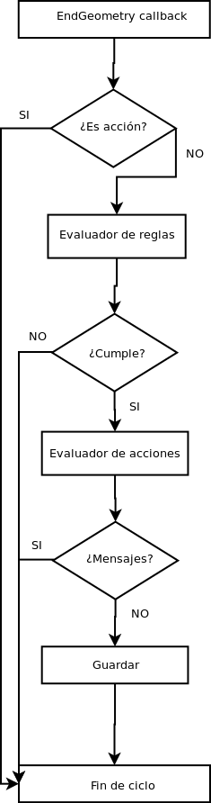

Resumen
=======

* La extensión ``ActionDispatcher.java`` escucha los eventos de fin de edición
  de las CADTools y, dependiendo de varias variables, decide cuál de las
  acciones lanzar.
* Cada una de las acciones del menú tiene un evaluador de reglas y de acciones
  (si es necesario). Ambos se pueden encontrar en el paquete
  ``es.icarto.gvsig.catastro.evaluator``.
* Cada una de las reglas debe implementar la interfaz IRule (si es una regla a
  cumplir) o IAction (si es una acción a realizar una vez se comprueben todas
  las anteriores reglas). Además, deben incluirse en el evaluador
  correspondiente.

Paquetes de interés:

* ``es.icarto.catastro``: contiene la extensión
  `ActionDispatcherExtension.java``, que implementa el algoritmo de evaluación
  de reglas y acciones.
* ``es.icarto.catastro.evaluator``: contiene los evaluadores de reglas y
  acciones para cada uno de los items del menú.
* ``es.icarto.catastro.evaluator.actions``: contiene las clases de cada una de
  las acciones a realizar.
* ``es.icarto.catastro.evaluator.rules``: contiene las clases de cada una de las
  reglas a realizar.

En detalle
==========

Una vez el usuario termina la digitalización (creación de una nueva manzana,
división de predio, etc), la herramienta de CAD correspondiente lanza un evento
de fin de edición. Este evento es capturado por la clase ActionDispatcher y
procesado para determinar qué acción es necesario realizar. La decisión se
realiza teniendo en cuenta varias variables: la CADTool que lanza el evento y la
capa sobre la que se ha realizado.

El flujo para cada uno de los ítems en el menú es similar: una vez entra en el
callback se comprueba que es una acción conocida; si es así, se lanza el
evaluador de reglas; en el caso de que todas las reglas sean cumplidas se lanza
el evaluador de acciones; si todas ellas resultan correctas (no hay mensajes) se guarda y finaliza el ciclo.

Se puede observar el flujo completo del algoritmo en el siguiente gráfico:

Reglas topológicas
==================

Para realizar las comprobaciones topológicas, se usa la librería Java Topology
Suite, JTS. En la instalación estándar de gvSIG por defecto tenemos a nuestra
disposición la versión 1.9, que ha sido la versión usada.

JTS y gvSIG tienen 2 modelos geométricos diferentes, por lo que es necesario
realizar la conversión entre modelos previamente a realizar una operación
topológica. Para cualquier operación de este tipo, el flujo ha sido el
siguiente:

#. Tomar con gvSIG las geometrías necesarias (realizando filtros, consultas, etc). El resultado es un IGeometry de gvSIG.
#. Convertir las geometrías de gvSIG (IGeometry) a geometrías de JTS (Geometry). La propia interfaz provee un método para realizar esta operación: ``ourIGeometry.toJTSGeometry();``
#. Realizar la operación o consulta espacial de entre las disponibles con JTS.
#. Usar el resultado de la operación resultante en nuestros propios algoritmos. Si ésta es una geometría, será necesario convertirla de nuevo a una geometría de gvSIG, lo que puede hacerse con el método ``FConverter.jts_to_geometry()``.

Interfaces IRule e IAction
==========================

Los evaluadores de acciones y reglas no son más clases que contienen las reglas
y las ejecutan iterativamente. Crear una nueva regla/acción es tan sencillo
como crear la propia regla/acción y añadirla al evaluador correspondiente.

Es necesario que las reglas implementen la interfaz IRule, que contienen 2
métodos:

* ``isObey()``: indica si la operación ha sido realizada con éxito.
* ``getMessage()``: que devuelve un mensaje de estado sobre la operación.

Igualmente, las acciones deben implementar la interfaz IAction, que contiene 2
métodos:

* ``execute()``: que indica con un booleano si la acción ha terminado
  correctametne o no.
* ``getMessage()``: que devuelve un mensaje de estado sobre la operación

